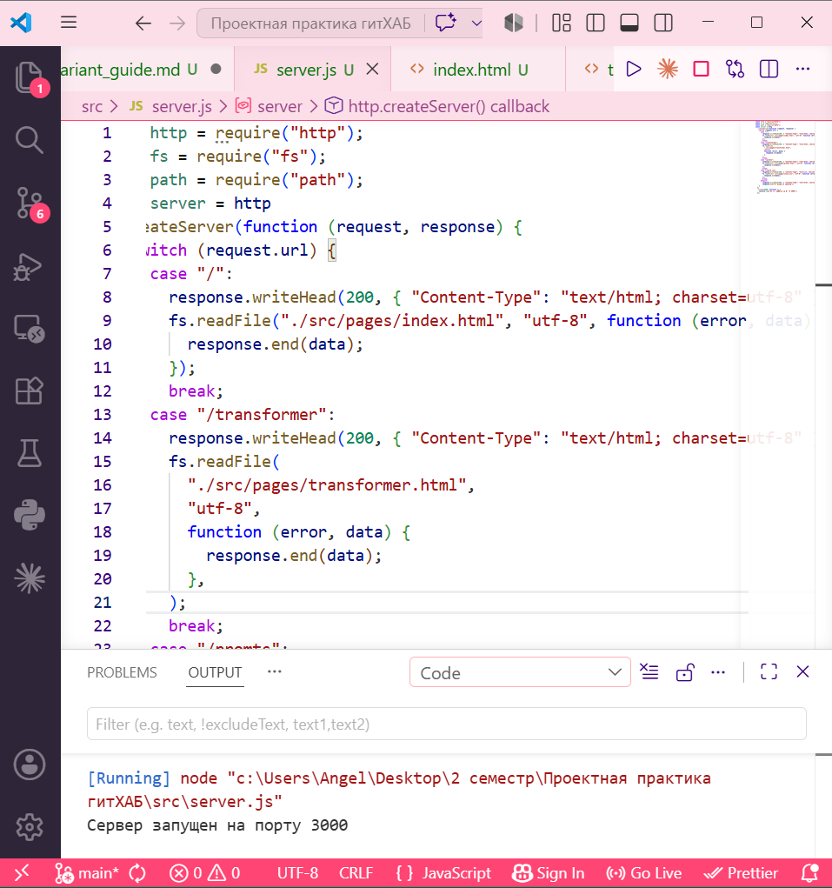
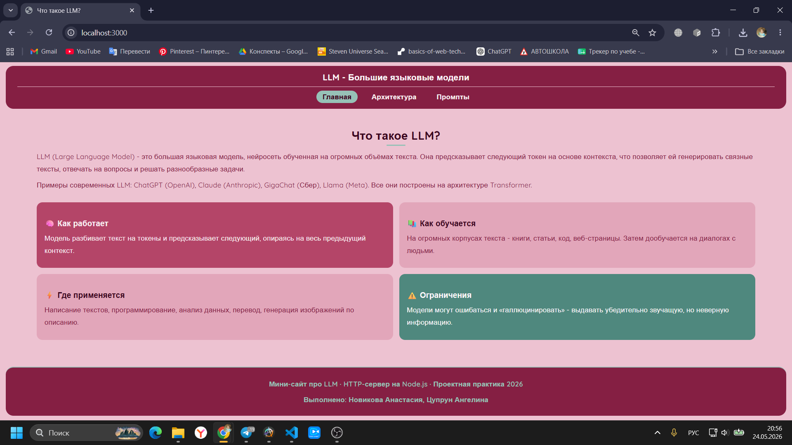
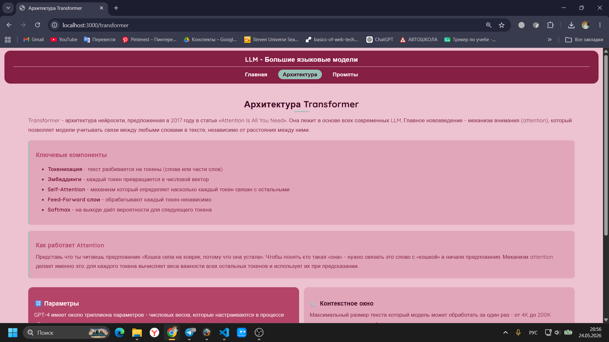
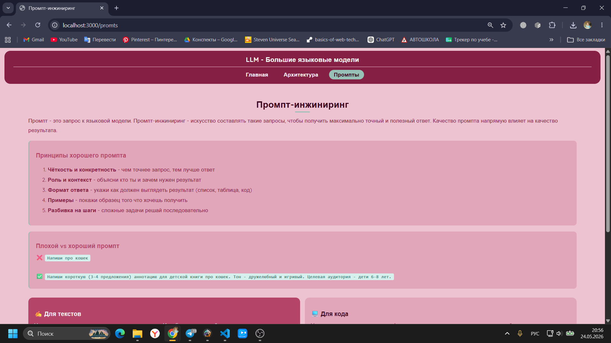

# Туториал: HTTP-сервер на Node.js с нуля

**Авторы:** Новикова Анастасия Станиславовна, Цупрун Ангелина Денисовна
**Группа:** 251-321  
**Дата:** май 2026

---

## Что мы делаем и зачем

HTTP-сервер - это программа которая принимает запросы от браузера и отвечает на них.
Когда ты открываешь любой сайт, браузер отправляет запрос на сервер, сервер читает
нужный файл и отдаёт его обратно. Обычно этим занимаются готовые решения вроде nginx,
но в этом туториале мы напишем такой сервер сами - с нуля, без сторонних библиотек,
только на встроенных модулях Node.js.

В качестве контента сервер будет отдавать три страницы про большие языковые модели (LLM) -
тему которую мы изучали в рамках онлайн-курса по искусственному интеллекту.

---

## Требования

- Node.js версии 18 и выше. Проверить: `node -v`
- Текстовый редактор (VS Code, Notepad++ или любой другой)
- Браузер

---

## Структура проекта

```
src/
├── server.js        ← основной файл сервера
└── pages/
    ├── index.html       ← главная страница (что такое LLM)
    ├── transformer.html ← архитектура Transformer
    ├── promts.html      ← промпт-инжиниринг
    └── style.css        ← стили для всех страниц
```

---

## Шаг 1 - Подключение модулей

Создай файл `src/server.js` и подключи три встроенных модуля Node.js:

```javascript
const http = require("http");
const fs = require("fs");
const path = require("path");
```

- `http` - модуль для создания HTTP-сервера и обработки запросов
- `fs` (file system) - модуль для чтения файлов с диска
- `path` - модуль для работы с путями к файлам

`require()` - это способ импортировать модуль в Node.js, аналог `import` в других языках.

---

## Шаг 2 - Создание сервера

Сервер создаётся через `http.createServer()`. Внутрь передаётся функция-обработчик,
которая будет вызываться при каждом входящем запросе. Она принимает два параметра:
`request` (данные о запросе) и `response` (объект для отправки ответа).

```javascript
const server = http
  .createServer(function (request, response) {
    // здесь обрабатываем запросы
  })
  .listen(3000, function () {
    console.log("Сервер запущен на порту 3000");
  });
```

`.listen(3000, ...)` - говорит серверу начать слушать порт 3000. Вторым параметром
передаём функцию которая выполнится когда сервер будет готов принимать запросы.

---

## Шаг 3 - Маршрутизация

Браузер указывает какую страницу хочет получить через URL. Узнать его можно
через `request.url`. В зависимости от URL нужно отвечать разным контентом -
для этого используем `switch/case`:

```javascript
switch (request.url) {
  case "/":
    // отвечаем главной страницей
    break;
  case "/transformer":
    // отвечаем страницей про Transformer
    break;
  case "/promts":
    // отвечаем страницей про промпты
    break;
  default:
    // если маршрут не найден - 404
}
```

`break` после каждого `case` обязателен - без него JavaScript «провалится»
в следующий case и выполнит лишний код.

---

## Шаг 4 - Отправка ответа

Каждый ответ состоит из двух частей:

1. **Заголовок** (`response.writeHead`) - сообщаем браузеру статус и тип контента
2. **Тело** (`response.end`) - сам контент

Для страниц которые не существуют отправляем статус `404`:

```javascript
default:
  response.writeHead(404, { "Content-Type": "text/html; charset=utf-8" });
  response.end("Страница не найдена");
```

---

## Шаг 5 - Чтение HTML-файлов

Вместо того чтобы хранить HTML прямо в коде, читаем файлы с диска через `fs.readFile()`.
Функция работает **асинхронно** - результат приходит не сразу, а через коллбэк-функцию
с параметрами `error` и `data`:

```javascript
case "/":
  response.writeHead(200, { "Content-Type": "text/html; charset=utf-8" });
  fs.readFile("./src/pages/index.html", "utf-8", function (error, data) {
    response.end(data);
  });
  break;
```

То же самое повторяем для остальных маршрутов.

---

## Шаг 6 - Подключение CSS

Браузер запрашивает CSS-файл отдельно - нужно обработать этот запрос тоже.
Отличие только в типе контента: `text/css` вместо `text/html`:

```javascript
case "/style.css":
  response.writeHead(200, { "Content-Type": "text/css; charset=utf-8" });
  fs.readFile("./src/pages/style.css", "utf-8", function (error, data) {
    response.end(data);
  });
  break;
```

---

## Итоговый код сервера

```javascript
const http = require("http");
const fs = require("fs");
const path = require("path");

const server = http
  .createServer(function (request, response) {
    switch (request.url) {
      case "/":
        response.writeHead(200, { "Content-Type": "text/html; charset=utf-8" });
        fs.readFile("./src/pages/index.html", "utf-8", function (error, data) {
          response.end(data);
        });
        break;
      case "/transformer":
        response.writeHead(200, { "Content-Type": "text/html; charset=utf-8" });
        fs.readFile("./src/pages/transformer.html", "utf-8", function (error, data) {
          response.end(data);
        });
        break;
      case "/promts":
        response.writeHead(200, { "Content-Type": "text/html; charset=utf-8" });
        fs.readFile("./src/pages/promts.html", "utf-8", function (error, data) {
          response.end(data);
        });
        break;
      case "/style.css":
        response.writeHead(200, { "Content-Type": "text/css; charset=utf-8" });
        fs.readFile("./src/pages/style.css", "utf-8", function (error, data) {
          response.end(data);
        });
        break;
      default:
        response.writeHead(404, { "Content-Type": "text/html; charset=utf-8" });
        response.end("Страница не найдена");
    }
  })
  .listen(3000, function () {
    console.log("Сервер запущен на порту 3000");
  });
```

---

## Запуск

```bash
cd src
node server.js
```

В консоли появится: `Сервер запущен на порту 3000`



Открой браузер и перейди на `http://localhost:3000`:







---

## Модификация

В базовой реализации HTTP-сервер просто отдаёт текстовые строки. Мы добавили:

- **Три полноценные HTML-страницы** с содержательным контентом про LLM -
  введение в языковые модели, архитектура Transformer, промпт-инжиниринг
- **Авторский CSS** в розово-бордовой палитре с типографикой Quicksand,
  карточками, highlight-блоками и hover-эффектами
- **Навигацию** между страницами с подсветкой активного раздела
- **Обработку статических файлов** - сервер умеет отдавать не только HTML но и CSS
- **Страницу 404** для несуществующих маршрутов

---

## Что можно улучшить дальше

- Добавить автоматическое определение типа файла по расширению - чтобы не прописывать
  каждый файл вручную
- Подключить шаблонизатор для динамической генерации HTML
- Добавить логирование всех запросов в файл
- Реализовать перезапуск сервера при изменении файлов (аналог `nodemon`)